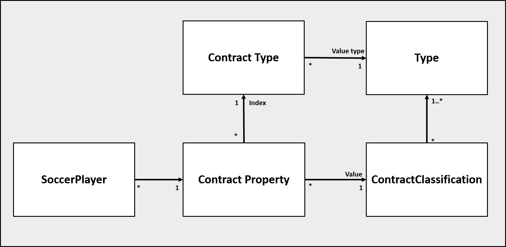
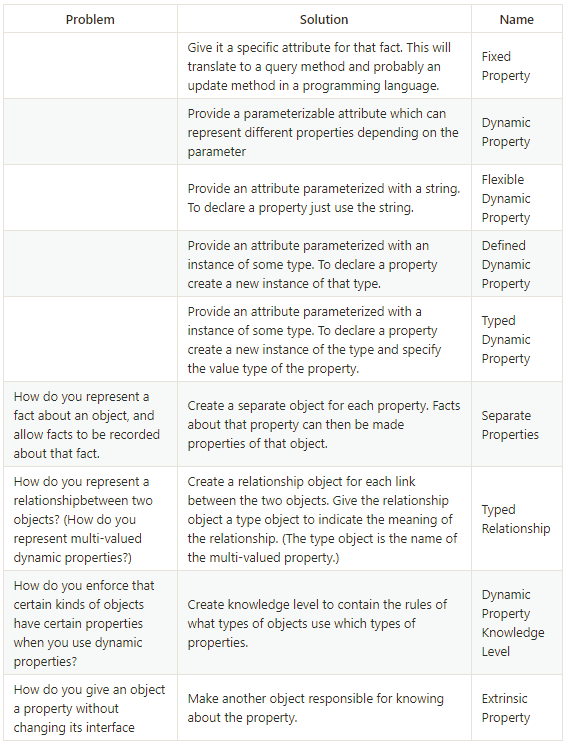

# Exercise "Implementing Properties"

## Basics on Property Modeling Approaches

The exercise is starting with a short theoretical task. The following figures show two different UML-diagrams of particular Dynamic Propery approaches. 
Try to understand the differnet relations and implementations of the diagrams and answer the follwoing questions: 

1. Which Dynamic Property Approaches are used in the figures? Write out the typical characteristics and differences between the shown UML-diagramms.

2. What's the main difference between Dynamic Properties and Fixed Properties? Which advantages and disadvantages do Dynamic Properties implicate?

Hint: Try to solve it by using the prepared documentation which contains a few hints: 

## Implementing the core API of the property pattern

### -- Preperations --

Please download the following `.zip`-File. It provides the basic structure of a Java Project implementing the concepts of the property pattern. Import/open the project in your favorite Java IDE (e.g. IntelliJ, Eclipse).

[implementing-properties](https://)

### Basic Tasks

1. Try to get familiar with the class structure provided by the project. Try to understand the different relationships. Especially take a look at the class `HashMapProperties.java` which represents a concrete implementation of a Property List. It implements the Interface `Properties` which provides the core API of the Property Pattern.  

2.  Implement the `put`-Method to add new properties to the HashMap. It is located in the class `HashMapProperties.java`.

_Hints_: 
	* Remind yourself that there can be a link to a parent HashMap (`PARENT`). Make sure the new value doesn't take it's value or doesn't match the Type of 'Properties'.
	* Take a look at the `has`-Method - it is already implemented and can help you in understanding 

3. Implement the `get`-Method to retrieve a property by it's name from the HashMap. It is located in the class `HashMapProperties.java`.

_Hint_:
	* Try to think about the two possible cases, where the given property can be located.

3. If the `put`and `get`-Methods are implemented correctly, try to build and run this project in the `main`-class. Can you see the differences of Inheritance of this soccer example?  

4. Bonus: Try to implement the `remove`-Method in the `HashMapProperties.java`-Class. Think again about the Deletion problem as mentioned in the presentation. Try it out by deleting a value in the `main`-Method. Did it work properly?

_Hints_:
	* If the property is located in the parent Property List set this property on `null`. 
	* If it is located in the local property list - delete the property completely

5. Think about it again: Why shouldn't you delete the Property if it is located in the parent Property List?
